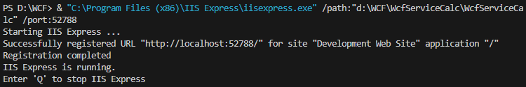
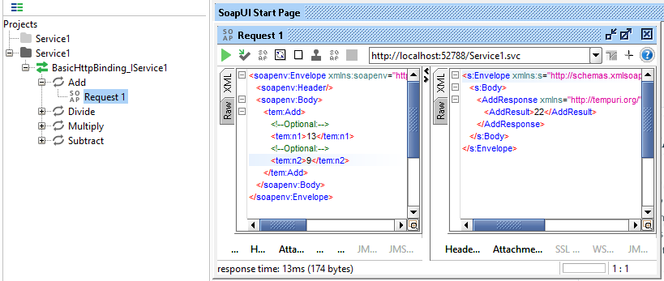
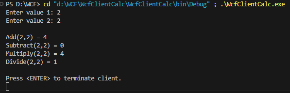
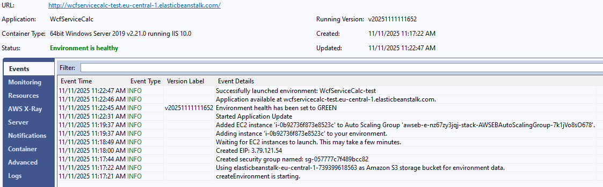
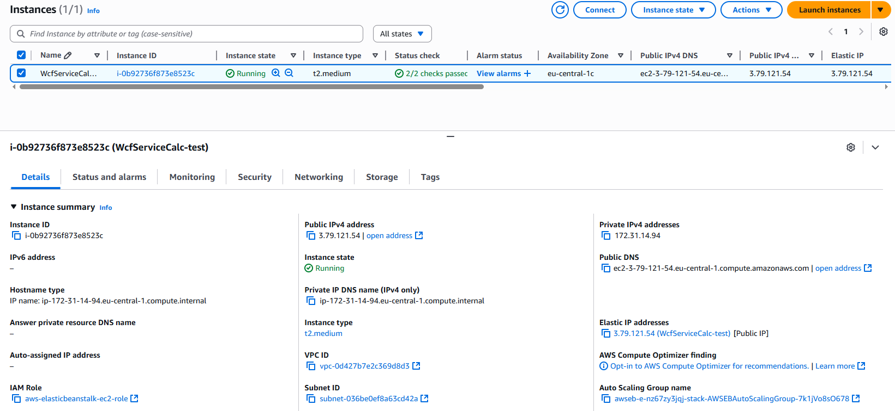
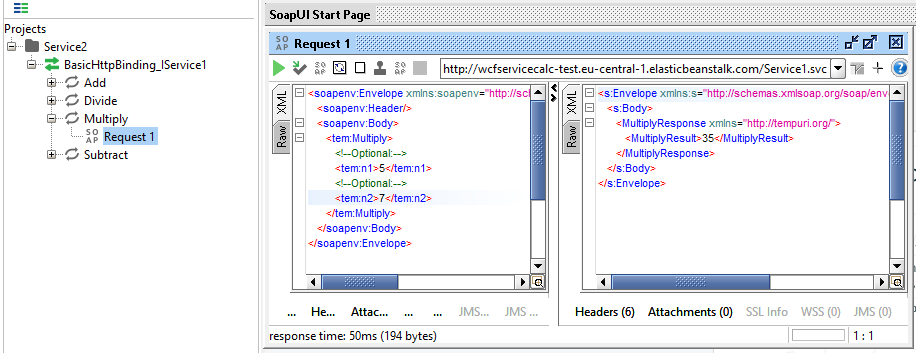

# Практична робота №4

## PaaS - Exploration and Deployment of WCF C# web services with AWS Elastic Beanstalk

### Завдання 1

На локальному робочому місці запущено наданий у методичному матеріалі код веб-сервісу на локальному веб-сервері **Internet Information Services (IIS)**. Лог роботи веб-серверу можна побачити на рисунку 1.

_Рисунок 1 – Вікно запущеного локально веб-сервісу_

### Завдання 2

Не зупиняючи локальний веб-сервіс в програмі **SoapUI** (безкоштовний інструмент з відкритим кодом для тестування веб-сервісів, таких як SOAP і REST API) виконано тестування веб-сервісу (рисунок 2).

_Рисунок 2 – Запит до локального веб-сервісу в середовищі SoapUI_

### Завдання 3

Завдяки наданому у методичних матеріалах клієнту протестовано роботу запущеного веб-сервісу на локальній машині (рисунок 3).

_Рисунок 3 – Вікно запущеного клієнта веб-сервісу_

### Завдання 4

Впевнившись, що наданий у завданні веб-сервіс працює локально без помилок, виконано розгортання проєкту у хмарі завдяки **AWS Elastic Beanstalk**. Процес розгортання можна побачити на рисунку 4.

_Рисунок 4 – Логування розгортання проєкту у хмарі_

Після отримання повідомлення про успішне розгортання проєкту можна побачити працюючий інстанс **Amazon EC2** (рисунок 5).

_Рисунок 5 – Працюючий інстанс з розгорнутим проєктом_

На рисунку вище можна побачити публічну адресу інстансу. Використовуючи її можна працювати з веб-сервісом.

_Рисунок 6 – Запит до хмарного веб-сервісу в середовищі SoapUI_

Після успішного виконання усіх попередніх завдань створені сервіси було знищено.

---

## ВИСНОВКИ

Протягом виконання практичної роботи було досягнуто поставленої мети – здобуто практичні навички розробки, тестування та розгортання веб-сервісів на основі технології **C# WCF** у хмарному середовищі **AWS Elastic Beanstalk (PaaS)**.

У ході виконання завдань було локально запущено веб-сервіс на **IIS**, протестовано його функціональність за допомогою інструменту **SoapUI**, а також реалізовано клієнтську частину для перевірки коректності роботи сервісу. Після цього здійснено розгортання проєкту у хмарі **AWS Elastic Beanstalk**, підтверджено працездатність сервісу на хмарному інстансі **Amazon EC2** та проведено повторне тестування запитів через **SoapUI**.

Отримані результати засвідчили переваги використання хмарних платформ типу **PaaS** для швидкого розгортання веб-додатків без необхідності ручного налаштування інфраструктури. Виконана робота сприяла формуванню практичних компетентностей у сфері розробки безпечних розподілених систем, а також поглибленню розуміння процесів інтеграції локальних і хмарних рішень на основі **сервісно-орієнтованої архітектури (SOA)**.

